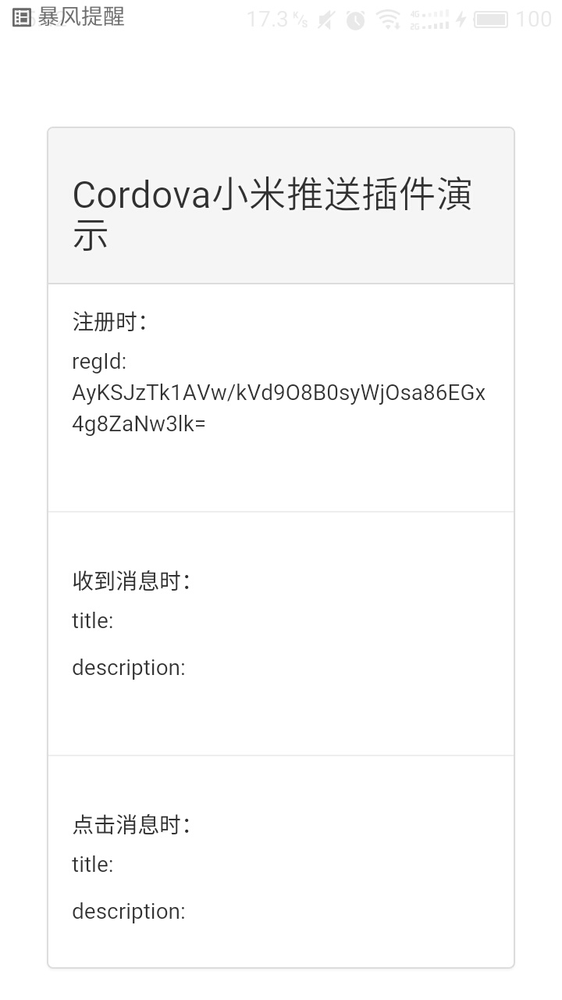
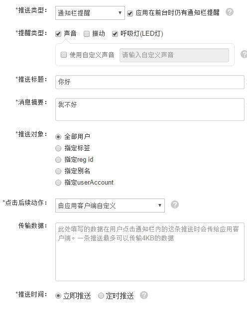
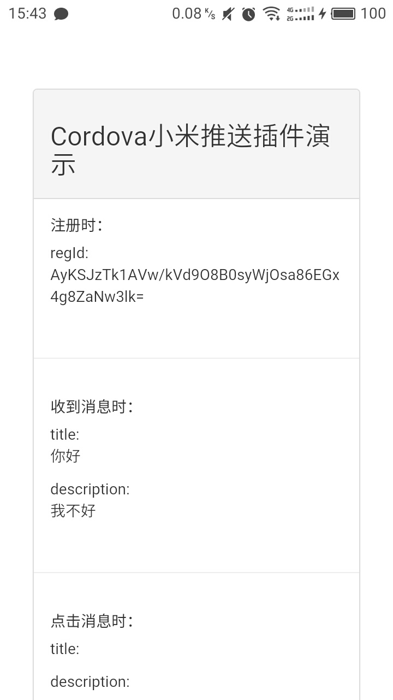
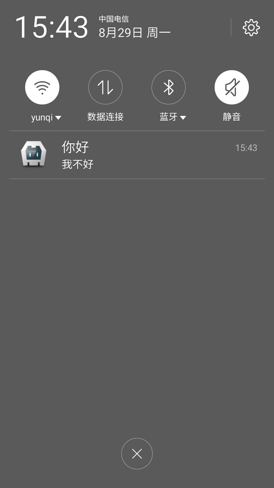
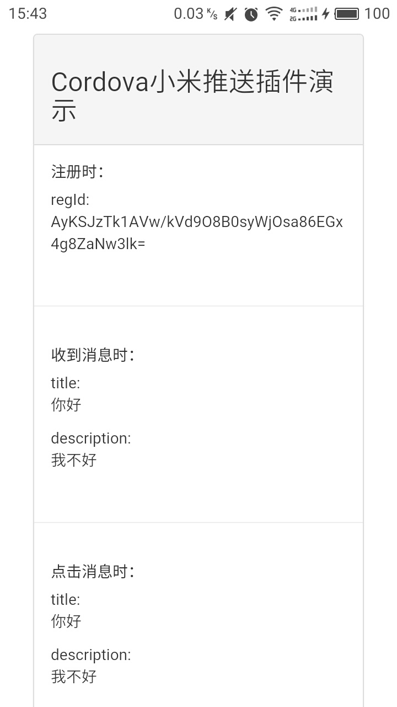

# Cordova MiPush Plugin

支持Android的Cordova小米推送插件

## 集成步骤

- 通过 Cordova Plugins 安装，要求 Cordova CLI 5.0+：
		
		cordova plugin add mipush-cordova-plugin --variable PACKAGE_NAME=your_android_project_package_name --variable MI_PUSH_APP_KEY=your_mipush_appkey --variable MI_PUSH_APP_ID=your_mipush_appid

- 通过Url安装:
	
		cordova plugin add https://github.com/ParadiseHell/mipush-cordova-plugin.git --variable PACKAGE_NAME=your_android_project_package_name --variable MI_PUSH_APP_KEY=your_mipush_appkey --variable MI_PUSH_APP_ID=your_mipush_appid

- 或者下载本地安装

		cordova plugin add Your_Plugin_Path --variable PACKAGE_NAME=your_android_project_package_name --variable MI_PUSH_APP_KEY=your_mipush_appkey --variable MI_PUSH_APP_ID=your_mipush_appid

## Demo

在插件项目的sample文件夹中包含一个简单的demo，若想参考，具体方法：
		
		sample/index.htm---->you_project_path/www/index.html
		sample/css/*---->you_project_path/www/css/
		sample/js/*---->you_project_path/www/js/

## 关于 PhoneGap build 云服务

该项目基于 Cordova 实现，目前无法使用 PhoneGap build 云服务进行打包，建议使用本地环境进行打包。

## API 说明

插件的 API 在 MiPush.js 文件中，该文件的具体位置如下：

### Android
	[Project]/assets/www/plugins/cordova-plugin-mipush/www

### 具体的 API 请参考：

- [Android API](/doc/android_api.md)

## 常见问题

若要使用 CLI 来编译项目，注意应使用 **cordova compile** 而不是 **cordova build** 命令，因为如果修改了插件安装时默认写入到 AndroidManifest.xml
中的代码，cordova build 可能会导致对 AndroidManifest.xml 的修改。
Cordova CLI 的具体用法可参考 [Cordova CLI 官方文档](https://cordova.apache.org/docs/en/latest/reference/cordova-cli/index.html)。

### Android

- Eclipse 中 import PhoneGap 工程之后出现：*Type CallbackContext cannot be resolved to a type*。

  解决方案：Eclipse 中右键单击工程名，Build Path -> Config Build Path -> Projects -> 选中工程名称 -> CordovaLib -> 点击 add。

## 截图

## 感谢

- [极光推送cordova插件](https://github.com/jpush/jpush-phonegap-plugin)

## 更多

- 本项目参考极光推送cordova插件编写
- 若有问题，请发我邮件：chengtaolearn@163.com